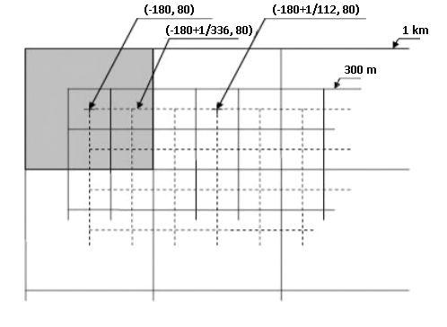

# Purpose

This notebook shows how to resample Copernicus Global Land Service vegetation-related products (i.e. NDVI, FAPAR...), based on PROBA-V observations, from 333m resolution to 1km using R-based packages and functions.

It is intended for users who would like to continue temporarily their 1km time series, in near real time, before switching to the new 333m baseline resolution.


# Step 1: Download or locate the input 333m product files

When running this notebook on VITO’s servers (e.g. notebooks.terrascope.be, notebooks.vgt.vito.be), you can follow the directions in [this notebook](https://nbviewer.jupyter.org/github/VITObelgium/notebook-samples/raw/master/datasets/probav/Reading%20PROBA-V%20using%20R.ipynb) to find the locations of input products. Doing so, the data set (netCDF files) will be located and available in the VITO's servers. In particular for the product types BioPar_NDVI300_V1_Global for 333m NDVI v1, BioPar_LAI300_V1_Global for LAI 333m v1 and similar for FAPAR, FCOVER, DMP and GDMP.

Alternatively, if you are working locally on your PC or laptop, you can choose to automatically download Copernicus Global Land Service products using the functions found in https://github.com/cgls/Copernicus-Global-Land-Service-Data-Download-with-R.

For more details on the products, please see the description and Product User Manuals documentation at https://land.copernicus.eu/global/products/


# Step 2: Reading in the data

Once the data set is available, *ncdf4* and *raster* packages functionalities are used to prepare it for resampling. Raw digital numbers (DN) stored in the netCFD files are used in order to avoid floating point imprecisions when scaling the values into real physical values (PV). R uses IEEE-754-Standard double-precision floating-point numbers, whereas the values in the netCDF are stored as float32. DN values can be scaled into PV aftewards using the formula PV = DN \* *scale* + *offset*.

The use of the *knitr* package is optional, it only helps with pretty-printing tables.

```{r}
if(require(ncdf4) == FALSE){install.packages("ncdf4", repos = "https://cloud.r-project.org"); library(ncdf4)} else {library(ncdf4)}
if(require(raster) == FALSE){install.packages("raster", repos = "https://cloud.r-project.org"); library(raster)} else {library(raster)}
if(require(knitr) == FALSE){install.packages("knitr", repos = "https://cloud.r-project.org"); library(knitr)} else {library(knitr)}

# ndvi_files is a list of the available files (Raster* objects or netCDF)
ndvi_files <- list(paste0(getwd(), "/ndvi300m_Cat.tif"))
```

&nbsp;

The original Global Land product files typically come in two flavours: the global netCDF4 files (the native production format) or GeoTIFF subsets. If the file is a GeoTIFF:
```{r}
if (grepl(".tif$", ndvi_files[[1]])){  
  r <- raster(ndvi_files[[1]])
}
```

&nbsp;

If the file is a netCDF4:
```{r}
if (grepl(".nc$", ndvi_files[[1]])){
  nc  <- nc_open(ndvi_files[[1]])
  lon <- ncvar_get(nc, "lon")
  lat <- ncvar_get(nc, "lat")
  #Copernicus nc files have lat/long belonging to the centre of the pixel, and R uses upper/left corner;
  #therefore, coordinates need to be adjusted
  lon <- lon - (1/336)/2                                   # 1/336 is the pixel resolution of the 333m product
  lat <- lat + (1/336)/2
  nc_data <- ncvar_get(nc, "NDVI", raw_datavals = TRUE)    # raw_datavals = TRUE to avoid automatic scaling of DN
  r <- raster(t(nc_data[, seq(dim(nc_data)[2], 1, -1)]))   # creating a raster object
  extent(r) <- c(range(lon)[1], (range(lon)[2] + (1/336)),
                 (range(lat)[1] - (1/336)), range(lat)[2]) # extent of the product 
  crs(r) <- CRS('+init=EPSG:4326')                         # coordinate reference system
}
```
**Note:**  *raster::raster()* can also read *nc* files (using *ncdf4* functionalities), but Digital Numbers are automatically scaled to physical values. As said before, we want to avoid this because of floating point imprecisions.


# Step 3: Checking the geographic extent and raster cropping

In the area-based resampling, we’ll aggregate a matrix of 3x3 pixels at the 333m resolution into a pixel at 1km resolution (*aggregate()* with factor 3). But before we do that, we need to make sure that the geographic extent matches nicely in both resolutions.

In your application, you may working with either

* global 1km data

* or a subset of one or more areas, whereby the desired extent is either defined as a coordinate vector or the extent of the series of 1km raster files that you are looking to continue.

This determines the next steps and raster cropping to be performed, so let’s take a look at these two cases.


## Option 1: resampling an entire global 300m raster

**Note:**  File formats like netCDF4 and GeoTIFF can be optimized for reading or storing large rasters through chunking and compression. Take care when reading in such a full global raster in your computer’s working memory in one go. A global 300m raster has 120960 columns and 47040 rows, or close to 5.7bn cells. The size in bytes of each cell is provided in the CSV file (column Bytes per Cell; see table below). Consider working in subsets or using parallel computing techniques (rasterOptions, cluster processing, etc.), as described [here](https://strimas.com/post/processing-large-rasters-in-r/).

Given the grid definition of the global 300m and 1km products (see image below), no proper aggregation of the finer resolution product can be performed at the minimum and maximum latitude and longitude. For this reason, the 300m *RasterLayer* object needs to be cropped accordingly.




```{r}
if(extent(r)[1] < -180 & extent(r)[2] > 179.997 &
   extent(r)[3] < -59.99554 & extent(r)[4] > 80){  # checking for full product (image)
  extnt_r <- extent(r)
  extnt_r[1] <- extent(r)[1] + (2 * (1 / 336)) # x-min
  extnt_r[2] <- extent(r)[2] - (1 * (1 / 336)) # x-max
  extnt_r[3] <- extent(r)[3] + (1 * (1 / 336))  # y-min
  extnt_r[4] <- extent(r)[4] - (2 * (1 / 336))  # y-max
  r <- crop(r, extnt_r)
}else{
  print("The image is not the full product; therefore, extent needs to be checked")
}
```


## Option 2: resampling geographic subsets

If you want to resample a geographic subset of the original 300m product, its new extent should match with the 1km product grid.

This target 1km grid or extent can be either 

* retrieved from a 1km *Raster*\* object, i.e. one of the rasters in your existing 1km time series:

```{r}
ndvi_files_1km <- list(paste0(getwd(), "/ndvi1km_Cat.tif"))
r_1km <- raster(ndvi_files_1km[[1]])

if(exists("r_1km") & all(round(res(r_1km), 10) == round(0.0089285714, 10))){
   my_extent <- extent(r_1km)
}else{
  stop("The given raster file does not exist or does not have the 1km resolution.")
}
```


* or provided as a vector with longitude/latitude coordinates, in decimal degrees, taking the form *c(Xmin, Xmax, Ymin, Ymax)*. Notice that these coordinates might be slightly adjusted to the 1km PROBA-V products grid.

```{r}
coords4subset <- c(0, 4, 40, 43)
my_extent <- extent(coords4subset)
```


Next, we’ll check if the new extent is found in the PROBA-V 1km product grid (cell boundaries). If it's not, it will be adjusted. Then, the product can be cropped to the new extent.


```{r echo = TRUE}
# The following vectors contain Long and Lat coordinates, respectively, of the 1km grid (cell boundaries):
x_ext <- seq((-180 - ((1 / 112) / 2)), 180, (1/112))
y_ext <- seq((80 + ((1 / 112) / 2)), - 60, - (1/112))
 
if(!all(round(my_extent[1], 7) %in% round(x_ext, 7) &
        round(my_extent[2], 7) %in% round(x_ext, 7) &
        round(my_extent[3], 7) %in% round(y_ext, 7) &
        round(my_extent[4], 7) %in% round(y_ext, 7))){
  # The given extent from raster or coordinate vector does not fit into the 1km PROBA-V grid, so we are going to adjust it
  for(crd in 1:length(as.vector(my_extent))){
    if(crd <= 2){
      my_extent[crd] <- x_ext[order(abs(x_ext - my_extent[crd]))][1]
    }else{
      my_extent[crd] <- y_ext[order(abs(y_ext - my_extent[crd]))][1]
    }
  }
  
  # Now we can crop the 300m raster
  r <- crop(r, my_extent)
}
```


# Step 4: Dealing with invalid (no-data) pixels

The original Global Land product can contain specific values (flags) for invalid pixels, which need to be dealt with. For this example, we’ll convert those into NoData (NA) values.

The range of valid pixel values, the scale factor and offset and any flag values used are described in the product documentation and netCDF file metadata.

For your convenience, a short table was prepared summarizing the range of valid values, both in raw digital number (DN) and physical value, for each product, version and data layer. Let’s read in this table from the csv file. 


```{r echo = FALSE}
cutoff_method_df <- read.csv(paste0(getwd(), "/Table_cutoff_and_resampleMethod.csv"),
                             stringsAsFactors = FALSE,
                             header = TRUE)
kable(cutoff_method_df[, 1:8], caption = "")
```

As an example, in the 300m NDVI products, digital values > 250 are flagged and need to be converted into NA. 


```{r}
cutoff_flag <- 250

r[r > cutoff_flag] <- NA
```

&nbsp;

Now we can scale the digital numbers into physical values. As said before, the physical or real value is computed as digital number * scale + offset, but this applies only for valid pixels.


```{r}
if (exists("nc")){
  # Retrieving scale factor and offset from netCDF metadata
  scale_fact <- nc$var$NDVI$scaleFact  
  offset_val <- nc$var$NDVI$addOffset
}else{
  # They can be set manually as well
  scale_fact <- 0.00400000018998981   # double-precision floating-point
  offset_val <- -0.07999999821186066
}

r <- r * scale_fact + offset_val
r  # To check that the values are correctly scaled (e.g. for NDVI between -0.08 and 0.92)

```

&nbsp;


# Step 5: Resampling using the aggregation approach

There are several approaches to resample data to a coarser resolution. The area-based aggregation methods group rectangular areas of cells of the finer resolution image to create a new map with larger cells. 

In this case, we’ll use the function *aggregate()* of the package *raster*, setting its aggregation factor to 3 (fact = 3) as each 1km cell will be built from a group of 3x3 333m cells. In addition, it's advised to include a condition that at least 5 out of the 9 pixels had to have valid values (i.e. not NA).

*aggregate()* can perform the calculation using different functions. While the default is the average (*mean()*) it can work also with *modal()*, *max()*, *min()* or even your own *ad hoc* functions (see *mean_w.cond()*, *closest_to_mean()* and *uncert_propag()* examples below). 

The following table recommends the best suited method for each product/layer.

```{r echo = FALSE}
kable(cutoff_method_df[, c(1:3, 9)], caption = "")
```

**Note:** Resampled QFLAG, LENGTH_BEFORE/AFTER and NOBS cannot be compared to the 1km products due to different implementations for 1km-v2 and 300m-v1 products. For example, LAI-NOBS ranges are 0-120 for 1km-v2 and 0-40 for 300m-v1, or LAI/FAPAR/FCOVER-LENGTH_BEFORE go up to 60 days and up to 210 days, respectively for both products.

Now the process of resampling itself can go ahead using *aggregate()*. The resample method can be assigned at this point.

```{r}
#aggr_method <- "mean_w.cond"
#aggr_method <- "closest_to_mean"
#aggr_method <- "uncert_propag"

mean_w.cond <- function(x, ...){ # mean including condition 'minimum 5 valid pixels'
  n_valid <- sum(!is.na(x)) # number of cells with valid value
  if(n_valid > 4){
    dts <- list(...)
    if(is.null(dts$na_rm)) dts$na_rm <- TRUE
    x_mean <- mean(x, na.rm = dts$na_rm)
    return(x_mean)
  }else{
    x_mean <- NA
    return(x_mean)
  }
}

closest_to_mean <- function(x, ...){
  n_valid <- sum(!is.na(x)) # number of cells with valid value
  if(n_valid > 4){  # minimum 5 valid pixels
    dts <- list(...)
    if(is.null(dts$na_rm)) dts$na_rm <- TRUE
    x_mean <- mean(x, na.rm = dts$na_rm)
    closest2avrge <- x[order(abs(x - x_mean))][1]
    return(closest2avrge)
  }else{
    closest2avrge <- NA
    return(closest2avrge)
  }
}

uncert_propag <- function(x, ...){ # uncertainty_propagation (including condition 'minimum 5 valid pixels')
  n_valid <- sum(!is.na(x)) # number of cells with valid value
  if(n_valid > 4){
    dts <- list(...)
    if(is.null(dts$na_rm)) dts$na_rm <- TRUE
    unc_prp <- sqrt(sum(x^2, na.rm = dts$na_rm)) / n_valid
    return(unc_prp)
  }else{
    unc_prp <- NA
    return(unc_prp)
  }
}


aggr_method <- "mean_w.cond"
r300m_resampled1km_Aggr <- aggregate(r,
                                     fact = 3, # from 333m to 1km  
                                     fun = aggr_method, 
                                     na.rm = TRUE, 
                                     filename = '')

# Only when working with Digital Numbers (not in physical values):
# r300m_resampled1km_Aggr <- round(r300m_resampled1km_Aggr)
```


# Step 6: Check the outcome and final remarks

Here are a couple of plots in case the user wants to take a look at the resampled map.

```{r}
plot(r, main = 'Original map at 300m')
```

```{r}
plot(r300m_resampled1km_Aggr, main = 'Resampled map to 1km')
```


In addition, you could apply the chosen resample method on older (non-near real time) 300m products and correlate the results with the 1km product of the same period.

[This](https://github.com/xavi-rp/ResampleTool_notebook/blob/master/Resample_Report_v2.5.pdf) document provides the results of such comparisons between 1km-resampled and 1km-produced data layers.
